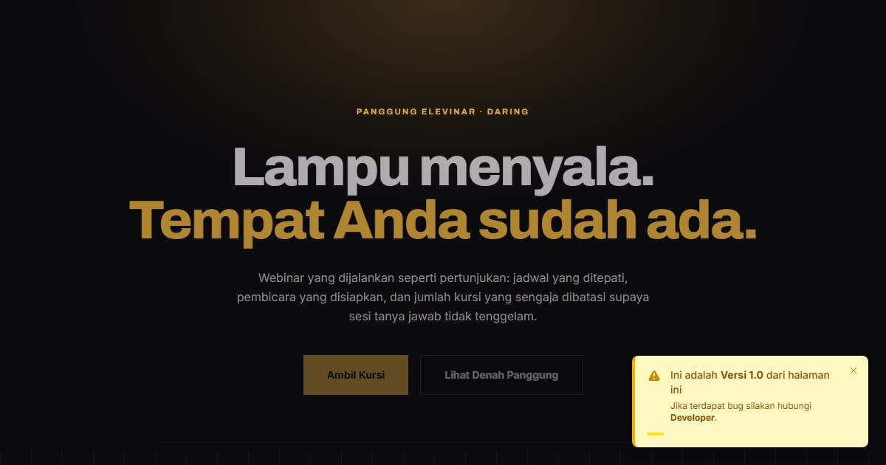

# Elevinar — Presentasi yang Didengar

Elevinar menjalankan webinar seperti pertunjukan. Pertunjukan #07 "Presentasi yang Didengar": empat babak, 300 kursi, Sabtu 21 November 2026, daring.

**Demo live:** https://landing-elevinar.vercel.app



> Template landing page untuk bisnis fiktif. Formulir di dalamnya hanya demo dan tidak mengirim data.

## Konsep

Bahasa rupa **Panggung**: webinar diperlakukan sebagai pertunjukan, dengan ruang gelap dan kerucut lampu sorot.

## Halaman

- `/` — Pertunjukan #07 "Presentasi yang Didengar": tiga babak, sorot pembicara, denah kursi, dan pendaftaran
- `/buku-acara` — buku acara bergaya program teater, siap dicetak
- `/pembicara/[slug]` — profil tiap pembicara beserta babak yang dibawakan

## Teknologi

- Next.js 15.5 (App Router) dan React 19
- Tailwind CSS v4
- JavaScript
- Framer Motion (animasi hero)
- Font: Archivo, Inter (next/font)
- SEO: metadata per halaman, Open Graph, JSON-LD, sitemap.xml, dan robots.txt

## Menjalankan secara lokal

```bash
npm install
npm run dev
```

Buka http://localhost:3000. Untuk build produksi: `npm run build` lalu `npm start`.

---

Bagian dari koleksi 17 template landing page di [PortalLanding](https://portal-landing-seven.vercel.app). Dibuat oleh [PintuWeb](https://pintuweb.com), jasa pembuatan website.
